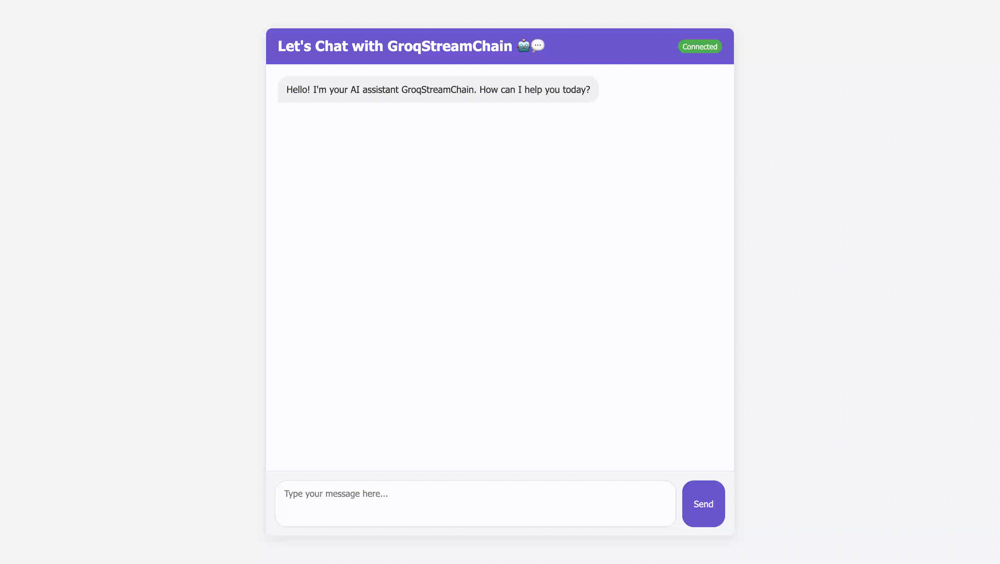

## Overview

**GroqChat** is a real-time, AI-powered chat application that uses WebSocket for low-latency communication and streams responses from a language model (LLM) powered by Groq and LangChain. The system is designed to provide a seamless conversational experience with real-time feedback and response streaming.
Here is the final view of the **GroqChat** chat application:

## Project Structure

The system is organized into separate modules, each with specific responsibilities:

- **`server.py`**: Main FastAPI application with WebSocket handling.
- **`config.py`**: Configuration management (e.g., API keys, model settings).
- **`models/chat.py`**: Data models for chats and messages.
- **`services/llm_service.py`**: LLM service using Groq and LangChain for AI-powered responses.
- **Frontend Files**: HTML, CSS, and JS files for the user interface.

## Key Features

1. **WebSocket Communication**: Provides real-time, low-latency communication between the client and server.
2. **Streaming Responses**: The system streams LLM responses chunk by chunk to the client, improving perceived latency and enhancing the user experience.
3. **Session Management**: Automatically creates and maintains unique chat sessions for each user interaction.
4. **Clean Frontend**: A simple, responsive UI with typing indicators and message formatting for a smooth user experience.
5. **Error Handling**: Handles WebSocket disconnections and reconnection attempts gracefully.

## How to Run the Project

### 1. Clone the project:

First, clone the project from GitHub using the following command:

